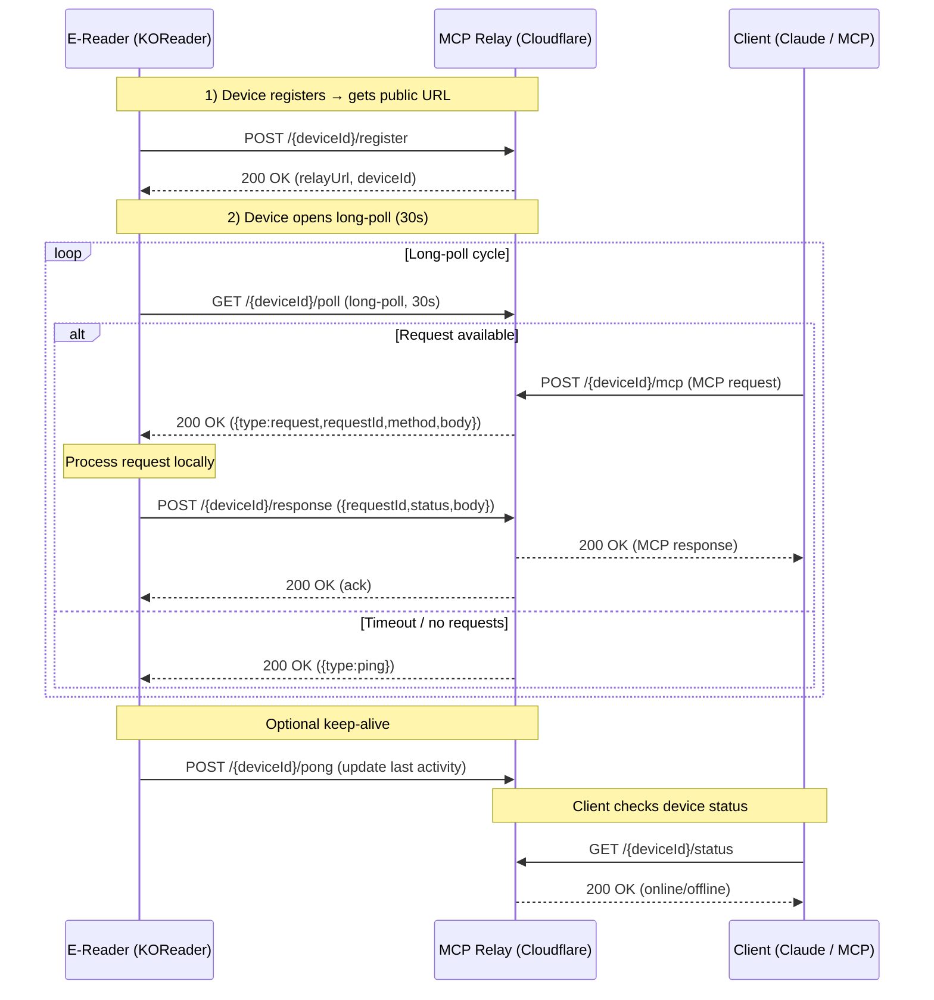
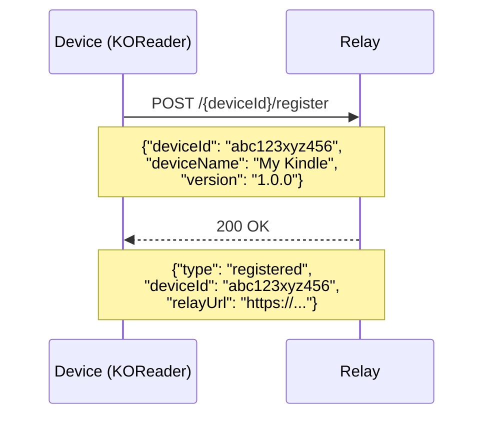
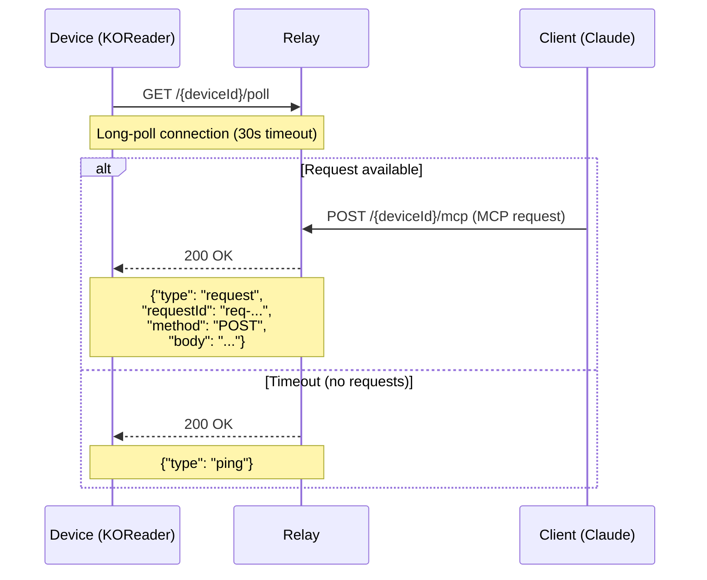
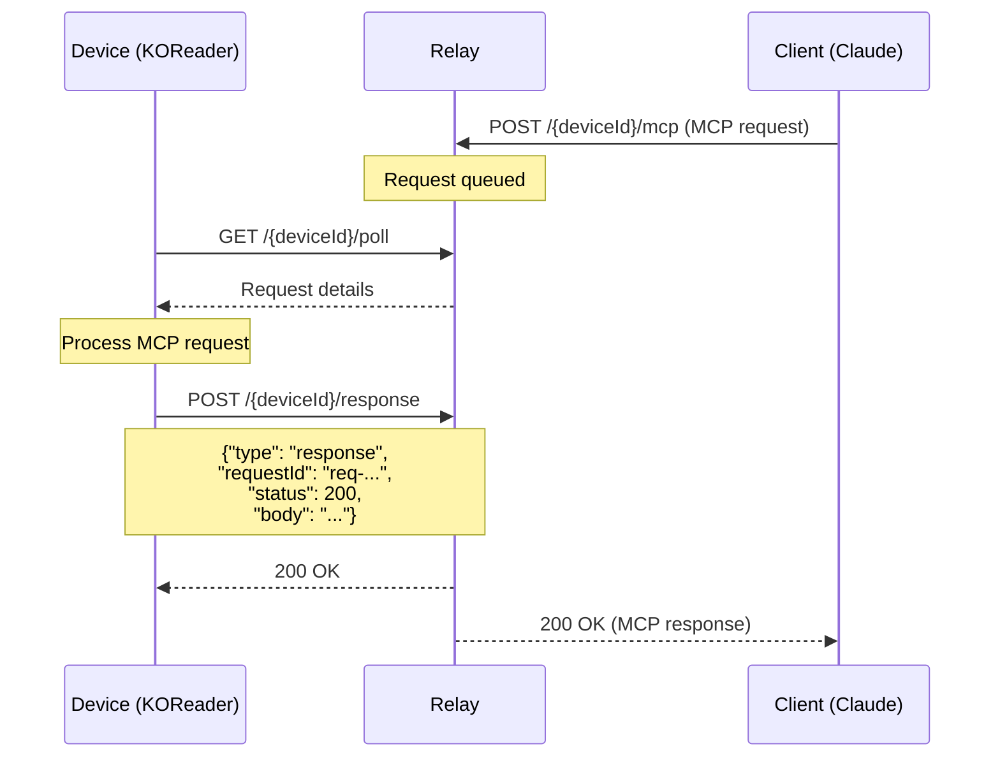

# MCP Relay for Cloudflare Workers

A lightweight HTTP long-polling relay that enables remote access to KOReader MCP servers from anywhere. This service bridges the gap between your e-reader and MCP clients like Claude Desktop or Claude Mobile.

## How It Works

1. Your e-reader registers with the relay and receives a public URL
2. The device polls for incoming MCP requests (long-polling with 30s timeout)
3. MCP clients (Claude, etc.) send HTTP requests to the device's public URL
4. The relay queues requests and delivers them when the device polls
5. The device processes requests locally and sends responses back



### Why HTTP Long-Polling?

KOReader uses LuaSocket which doesn't have native WebSocket support. HTTP long-polling provides:
- **Compatibility**: Works with any HTTP client
- **Simplicity**: No complex connection state management
- **Battery efficiency**: Adaptive polling intervals (0.5s - 5s)
- **Reliability**: Automatic reconnection on network issues

## Deployment

### Prerequisites

- npm/bun
- Cloudflare account (_free tier_ works!)

### Deploy to Cloudflare

1. Install dependencies
    ```bash
    bun install
    ```

2. Login to Cloudflare
    ```bash
    bun run wrangler login
    ```

3. Deploy
    ```bash
    bun run wrangler deploy
    ```

Your relay will be available at: `https://mcp-relay.<your-subdomain>.workers.dev/`

## API Endpoints

### `GET /`
Returns relay info and available endpoints.

### Device Endpoints (used by KOReader)

| Endpoint               | Method | Description                          |
| ---------------------- | ------ | ------------------------------------ |
| `/{deviceId}/register` | POST   | Register device and get public URL   |
| `/{deviceId}/poll`     | GET    | Long-poll for incoming MCP requests  |
| `/{deviceId}/response` | POST   | Send response to a forwarded request |
| `/{deviceId}/pong`     | POST   | Keep-alive heartbeat (optional)      |

### Client Endpoints (used by Claude/MCP clients)

| Endpoint             | Method | Description                |
| -------------------- | ------ | -------------------------- |
| `/{deviceId}/mcp`    | POST   | Send MCP request to device |
| `/{deviceId}/status` | GET    | Check if device is online  |

## Protocol

### Device Registration



### Polling for Requests



### Sending Response



### Keep-Alive (Optional)

**Request:** `POST /{deviceId}/pong`

The device can send pong to update its last activity timestamp without waiting for a full poll cycle.

## Timeouts and Configuration

| Parameter        | Value    | Description                                      |
| ---------------- | -------- | ------------------------------------------------ |
| Poll timeout     | 30s      | How long the relay waits before returning `ping` |
| Request timeout  | 30s      | How long client waits for device response        |
| Session timeout  | 2min     | Device considered offline after no activity      |
| Device ID length | 12 chars | Alphanumeric, lowercase                          |

### Client-side (KOReader) Adaptive Polling

The KOReader client uses adaptive polling intervals:
- **Active**: 0.5s between polls (when recently handling requests)
- **Idle**: Up to 5s between polls (battery saving mode)

## Custom Domain (Optional)

To use a custom domain like `mcp.yourdomain.com`:

1. Add your domain to Cloudflare
2. Update the route in `wrangler.toml`:
   ```toml
   [[routes]]
   pattern = "mcp.yourdomain.com/*"
   custom_domain = true
   ```
3. Redeploy: `npx wrangler deploy`

## Security

- **Device ID as secret**: The 12-character device ID acts as a bearer token. Anyone with the ID can send requests to your device.
- **All traffic encrypted**: HTTPS for all communication.
- **No stored content**: The relay doesn't persist MCP request/response content, only device registration data.

## Cost Estimation (Cloudflare Free Tier)

Casual usage should fit within Cloudflare's free tier limits:

| Resource                | Free Tier Limit | Expected Usage |
| ----------------------- | --------------- | -------------- |
| Worker Requests         | 100,000/day     | ~1,000/day     |
| Durable Object Requests | 1,000,000/month | ~10,000/month  |
| Durable Object Storage  | 1 GB            | ~1 MB          |
